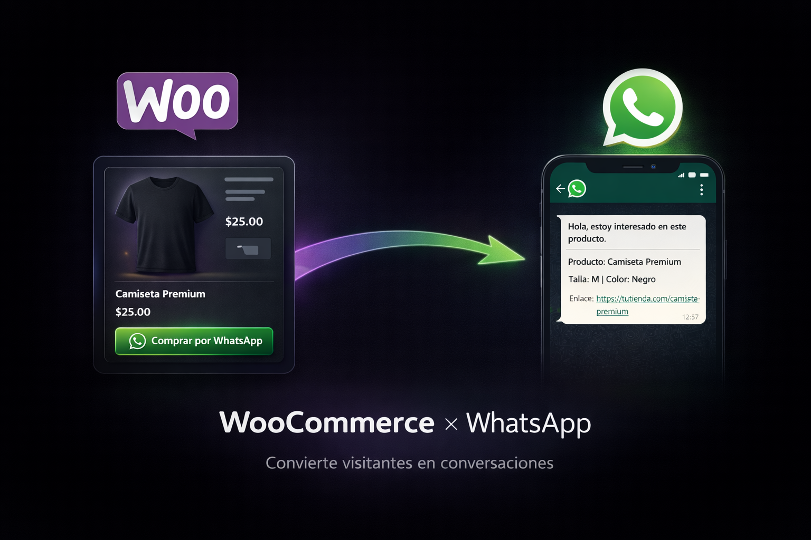

# WMC WhatsApp Plugin para WooCommerce

Desarrollado por <a href="https://webmastercol.com/" target="_blank" rel="noopener noreferrer">Webmastercol</a>

---

## ¿Qué es este plugin?

Plugin personalizado para WooCommerce diseñado para mejorar conversión y experiencia del cliente mediante un botón de WhatsApp configurable, disponible tanto en la página individual del producto como en listados (tienda, categorías y etiquetas).

La implementación permite habilitar o deshabilitar el botón por contexto, e incluso reemplazar el flujo tradicional ocultando el botón de “Añadir al carrito” cuando el negocio requiere una venta 100 % asistida por chat.

---

## ¿Cómo aporta valor al proceso de venta?

El funcionamiento es directo y orientado a venta: el botón se puede insertar con el shortcode `[wmc_whatsapp_button]` y, al hacer clic, genera automáticamente un enlace `wa.me` que abre WhatsApp en una nueva pestaña con un mensaje precargado.

Ese mensaje incluye el texto base configurable, el nombre del producto y la URL del producto. En productos variables, el plugin detecta la selección del cliente (variaciones elegidas) y las agrega al mensaje para que el equipo comercial reciba el contexto completo desde el primer mensaje, sin preguntas innecesarias y con mayor velocidad de cierre.

---

## Nivel de personalización

A nivel de personalización, incorpora un panel de ajustes dentro del menú de WooCommerce para administrar: número de WhatsApp, texto del botón, mensaje predeterminado, habilitación en producto y archivo, colores (normal y hover), color del texto, tamaño del texto/ícono y la opción de mostrar u ocultar el ícono de WhatsApp.

El botón se renderiza con estilos integrados y responsivos, manteniendo una estética consistente con el sitio sin exigir dependencias externas.

---

## Enfoque de desarrollo

Este proyecto evidencia capacidades en desarrollo de plugins a medida para WordPress/WooCommerce, construcción de paneles de configuración, uso de hooks para extender el frontend de WooCommerce y un enfoque práctico en performance y usabilidad para eCommerce.

**Tecnologías y stack:** WordPress, WooCommerce, PHP, JavaScript (vanilla), HTML/CSS, integración mediante shortcodes y hooks.
